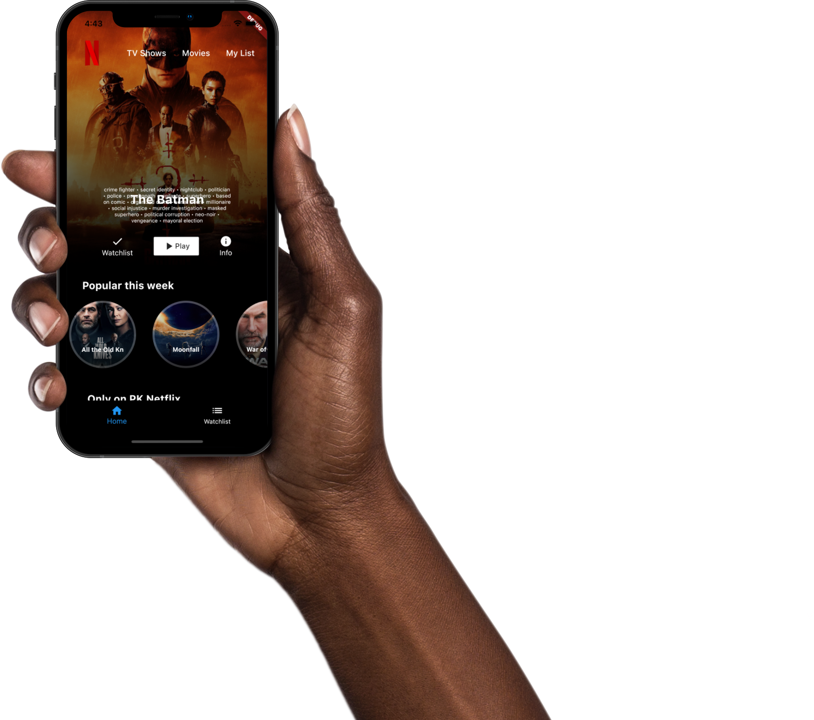

# PK Netflix

A new Flutter Netflix clone which includes both Frontend and Backend (Appwrite.io).

### Show some :heart: and star the repo.

---

## [Subscribe to Codepur](https://codepur.dev/)

## Project Created & Maintained By

### Pawan Kumar

Google Developer Expert for Flutter. Passionate #Flutter, #Android Developer. #Entrepreneur #YouTuber

 

# Donate

> If you found this project helpful or you learned something from the source code and want to thank me, consider buying me a cup of :coffee:
>
> - [PayPal](https://www.paypal.me/imthepk/)

## Copyright-and-license

Code and documentation Copyright 2022 [Pawan Kumar](https://codepur.dev). Code released under the [Apache License](./LICENSE). Docs released under [Creative Commons](https://creativecommons.org/licenses/by/3.0/).
